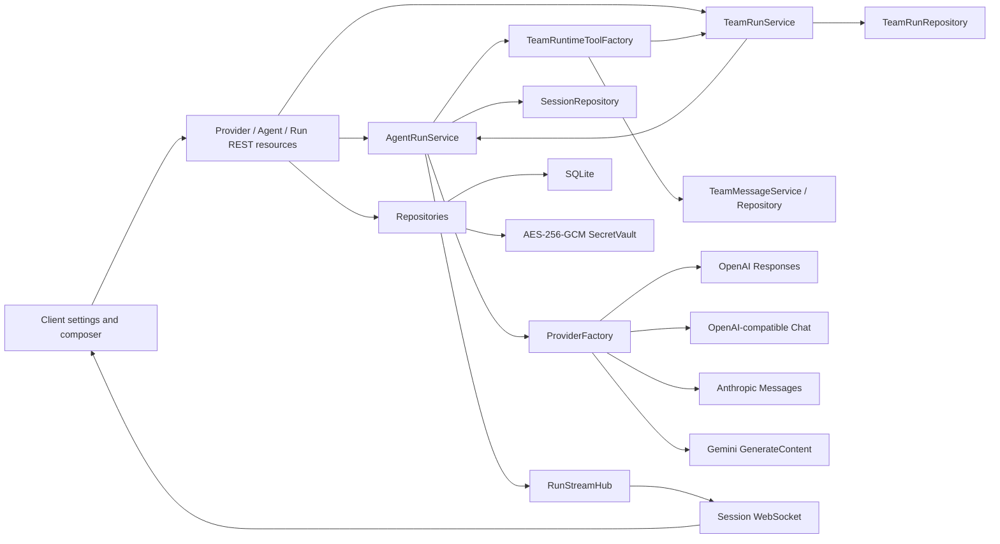

# Agent Runtime 2A-3B Architecture

## Scope

Phase 2A delivers the real provider path. Phase 2B1 adds bounded read-only workspace tools. Phase 2B2 adds a real approval-gated `write_file` path that can be decided from another connected client. Phase 2B3 adds a real approval-gated one-shot `shell_command`. Phase 2B4 adds persistent deny/ask/allow rules for protected tools. Phase 2C adds real Provider streaming and transient cross-device live drafts. Phase 3A adds manually launched, isolated and bounded parallel SubAgent teams with durable roster/status. Phase 3B adds model-initiated bounded delegation and a durable Agent message bus. MCP, PTY/background sessions, OS sandboxing, durable run replay and worktree isolation/merge remain outside the current scope.

## Module boundaries

`@prometheus/agent-core` owns provider-neutral message types and SDK adapters. It has no Fastify, SQLite, filesystem, or UI dependency. The server owns encrypted configuration, reconstructs session history, chooses an adapter, and records run boundaries.

## Secret handling

- API keys are accepted only on create/update requests and never returned.
- Provider responses expose `hasApiKey`, not ciphertext or plaintext.
- SQLite stores an AES-256-GCM envelope with a unique IV and authentication tag.
- The 32-byte master key comes from `PROMETHEUS_MASTER_KEY` (base64) or a persisted `PROMETHEUS_MASTER_KEY_FILE`.
- The default key file lives beside the SQLite database and is created once. Container deployments must persist `/data`.

## Durable run contract

1. Validate session, agent, provider, model, and secret before a network request.
2. Persist `agent.run.started` with `runId`, agent ID, provider ID, and model.
3. Reconstruct only `message.user` and `message.agent` events in sequence order.
4. Call the official provider SDK with a bounded timeout; when supported, forward text delta through the transient stream channel.
5. Execute tool calls only from the completed Provider response, never from partial argument delta.
6. Persist one `message.agent` event containing the complete response; no `run.stream.*` envelope is stored in SQLite.
7. Persist `agent.run.completed` with provider usage when available.
8. On error, persist `agent.run.failed` with a sanitized message; never persist API keys or raw authorization headers.

The HTTP request may disconnect, but durable run events remain visible to all clients. Provider streams are not resumed after process failure; recovery starts from the last durable boundary.

## REST resources

- `GET /api/providers`
- `POST /api/providers`
- `PATCH /api/providers/{providerId}`
- `GET /api/agents`
- `POST /api/agents`
- `PATCH /api/agents/{agentId}`
- `GET /api/permission-rules`
- `POST /api/permission-rules`
- `DELETE /api/permission-rules/{ruleId}`
- `POST /api/sessions/{sessionId}/runs`
- `GET /api/sessions/{sessionId}/team-runs`
- `POST /api/sessions/{sessionId}/team-runs`
- `GET /api/team-runs/{teamRunId}`
- `GET /api/team-runs/{teamRunId}/messages?afterSequence=N`

Delete endpoints are intentionally deferred until ownership and referential behavior are specified.
Agent create/update requests that reference a missing Provider return `422 configuration_reference_not_found`; foreign-key failures are not exposed as server errors.

## Verified boundary

The local end-to-end fixture implements a real OpenAI-compatible SSE stream and lives only under `scripts/`. It splits text across delayed chunks, splits tool-call JSON arguments across chunks, emits a usage-only chunk and terminates with `[DONE]`. Product code still goes through the official SDK adapter and contains no fixed reply, demo Provider, or fallback assistant text. The streaming two-browser E2E verifies that a second terminal sees text growth before the final durable reply, then verifies one `message.agent`, no durable `run.stream.*` event, and SQLite-backed reload. The Team E2E sends two overlapping Provider requests with different Agent system prompts, observes two simultaneous streaming cards and running statuses on another browser, then verifies two durable SubAgent replies, completed roster and reload. As of 2026-07-23, no paid Provider credential was available in the environment, so paid-provider live-call verification was not executed.

## Phase 3C: isolated Git worktrees and conservative patch integration

Team creation now declares `workspaceMode` (`readonly` or `worktree`) and `mergeStrategy` (`manual` or `auto`). Readonly remains the default and gives child Agents only list/read/search plus team communication. Worktree mode requires exactly one path assignment for every selected Agent, rejects absolute, dot, parent and `.git` paths, and rejects overlapping prefixes across Agents.

`GitWorktreeManager` is the sole Git lifecycle module. It verifies a real repository with a usable HEAD, creates `prometheus/team/{taskId}` under the configured worktree storage root, and binds the child workspace to the corresponding repository-relative directory. It audits tracked, untracked, deleted and renamed files, stages only to produce a binary patch, and restores the worktree index immediately afterward. Changes outside the assignment become `rejected`; repository-level paths outside a nested workspace are never eligible for apply.

Manual integration stores `changedPaths`, `patchBytes`, branch/base commit and `pending` status in SQLite. Any connected Web/Tauri terminal can invoke the task Apply or Discard resource. Auto integration and manual Apply both use direct `git apply --check --binary` before writing the parent repository. A failed check returns `conflicted` with paths and leaves both parent content and isolated worktree untouched. There is no automatic `--3way`, conflict-marker creation, file-copy fallback, commit, merge or push.

Cleanup verifies storage-root containment, shared Git common directory, the `prometheus/team/` branch prefix and the worktree's checked-out branch. Dirty worktrees are removed only after `applied`, `no_changes`, or explicit discard. On Control Plane restart, stored isolated worktrees are re-audited into pending/rejected/no_changes state without replaying Provider requests or applying changes.

The two-browser E2E uses a temporary real Git repository and a real Provider `write_file` tool call. A second terminal approves the write; the parent remains unchanged until UI Apply; successful apply creates the parent file and removes the worktree/branch; reload preserves durable metadata. A second case changes the parent before Apply and proves the conflict neither overwrites the parent nor removes the isolated worktree.

Worktree isolation is not an OS sandbox. Shell still uses the existing approval/policy path and can access capabilities granted by the host process. 3C does not provide containers, cross-node filesystems, distributed locks, automatic conflict resolution or restart continuation of an in-flight Provider request.

## Phase 3B: model delegation and durable Agent messages

`AgentRunService` now accepts a runtime tool factory after the run ID is known. A primary execution receives `delegate_team` only when another configured Agent is available. The tool schema contains the current eligible Agent IDs and descriptions, validates unique 1-8 member selection and bounds concurrency to 1-4. Executing the tool calls the existing `TeamRunService`; the complete bounded task reports and messages are returned through the normal provider tool-result round trip.

Subagent executions never receive `delegate_team`. They receive `send_team_message` and `read_team_messages`, so recursive team creation is prevented by capability construction rather than prompt wording. The send tool accepts `parent`, `*` or a current TeamRun member UUID and normalizes `direct/shared/decision/question` channels. Unknown recipients fail before persistence. The read tool returns only broadcast, direct-to-self and self-sent messages after a sequence, with an optional bounded wait of at most five seconds.

`team_messages` stores sender/recipient labels, channel, optional subject, bounded body, source run/tool call and creation time. `TeamMessageService` persists first, then commits `agent.message` to the session log and publishes it through the existing WebSocket. Web/Tauri clients fetch the message resource and render it inside the durable Team panel; no browser-only bus exists.

The autonomous two-browser E2E proves the full model path: the coordinator Provider emits `delegate_team`; one child emits `send_team_message`; another child waits with `read_team_messages`, consumes that evidence and replies; the coordinator receives the complete team tool result before producing its final durable response. 3B does not provide recursive delegation, external wake/interrupt of idle agents, worktree isolation, patch apply/merge, restart continuation or cross-node scheduling.

## Phase 3A: isolated bounded SubAgent teams

The GUI starts a TeamRun from 1-8 configured Agent profiles and a concrete team goal. `maxConcurrency` is bounded to 1-4. `TeamRunService` owns only orchestration: it creates the durable roster, emits `agent.spawned`, runs a fixed-size worker pool and records `agent.status`. Every task delegates to `AgentRunService.runTask`, so there is no second Provider or tool runtime.

Each child receives one explicit prompt containing the team goal and assigned role. It does not read the parent session's message history. Child lifecycle events carry `teamRunId`, `teamTaskId` and `isSubagent: true`; primary history reconstruction ignores SubAgent messages, preventing team output from silently entering the next primary run. The final reply remains a normal durable `message.agent` fact and is also stored as the TeamTask output.

`team_runs` and `team_run_tasks` persist the roster, task prompt, status, output/error and timestamps. One task failure is isolated: other workers continue, and the overall TeamRun becomes `failed` only after all tasks reach a terminal state. On startup, queued/running tasks become `interrupted`; they are not automatically replayed.

`RunStreamHub` stores a map of active runs per session. Late clients receive every current snapshot, and terminal events clear only the matching run. This makes parallel drafts observable across devices without copying token deltas into SQLite.

3A itself is deliberately manual; the later 3B slice adds model-initiated bounded delegation and Agent-to-Agent direct/shared/decision/question messages. DAG planning, worktree/container write isolation, automatic merge, restart replay and cross-node scheduling remain outside 3A/3B.

## Phase 2C: transient cross-device Provider streaming

`@prometheus/agent-core` exposes one provider-neutral stream contract: `text.delta` is presentation-only and `response.completed` is the sole source of final text, usage and tool calls. The Agent Loop emits `provider.turn.started` for every model turn and `assistant.text.delta` for display. A stream that ends without exactly one completed response, or emits completion twice, fails explicitly. Providers without `stream()` retain the non-streaming `generate()` fallback.

The four built-in adapters use their native SDK streaming APIs:

- OpenAI Responses maps `response.output_text.delta` and completes from `response.completed.response`.
- OpenAI-compatible Chat accumulates content and tool calls by index, including fragmented JSON arguments.
- Anthropic displays only `text_delta`; complete tool input comes from `finalMessage()`.
- Gemini accumulates `generateContentStream()` chunks, function calls and usage.

The server keeps active text in a dedicated `RunStreamHub`, keyed by session and guarded by run ID, turn and monotonically increasing revision. It emits `run.stream.snapshot`, `run.stream.delta` and `run.stream.cleared` WebSocket envelopes. These envelopes are deliberately outside `SessionEvent`: a late-joining client gets the current snapshot, while reconnecting clients still recover durable history from `afterSequence`.

The client accepts only contiguous revisions for the current run/turn. A new turn replaces the previous draft. Final `message.agent` and `agent.run.failed` events clear the matching draft, as does the explicit cleared envelope. This prevents partial text from being mistaken for committed history.

2C does not recover an in-flight Provider request after Control Plane restart. It also does not provide cancellation, steering/follow-up queues, reasoning-token display or partial tool execution.

## Phase 2B1: read-only workspace tools

The runtime now exposes three real tools to every configured Provider:

- `list_directory`: list a workspace-relative directory while ignoring dependency/build metadata directories.
- `read_file`: read a UTF-8 text file with a 64 KiB response bound; binary files and paths outside the workspace are rejected.
- `search_text`: recursively search UTF-8 files for literal text with bounded results and relative-path evidence.

`@prometheus/agent-core` owns the provider-neutral sequential loop and maps tool calls/results through OpenAI Responses, OpenAI-compatible Chat Completions, Anthropic Messages, and Gemini GenerateContent. Filesystem implementations remain server-only. Each invocation persists `tool.call.started` and `tool.call.completed` into the same ordered session log before the final `message.agent` event.

Write/edit, shell execution, approval policies, sandboxing, hooks, MCP, and SubAgents are not part of 2B1. Write and one-shot Shell become connected only in their later slices; sandboxing, hooks, MCP and SubAgents remain unavailable.

## Phase 2B2: approval-gated workspace writes

`write_file` is registered beside the read tools but declares `approval: "always"`. The provider-neutral loop calls an authorization callback before `execute`; without an authorizer the safe default is denial. A denial becomes an error tool result and is returned to the model, so the Agent can report the decision without manufacturing a successful write.

The server owns an independent `ApprovalCoordinator`. For each protected call it:

1. persists `tool.call.started`;
2. creates an in-process pending resolver;
3. persists `approval.requested` with the stable run/tool/approval IDs;
4. waits until a client posts a decision;
5. persists `approval.resolved`;
6. executes the tool only after `approved`, then persists `tool.call.completed`.

The resource endpoint is:

`POST /api/sessions/{sessionId}/approvals/{approvalId}/resolution`

with `{ "decision": "approved" }` or `{ "decision": "denied" }`. Unknown and cross-session IDs return 404; an already resolved approval returns 409. The decision event is distributed through the existing WebSocket stream, so no UI-private approval channel exists.

`write_file` accepts a workspace-relative path and complete UTF-8 content. It requires an existing parent directory, canonicalizes the real parent, rejects paths outside the workspace, rejects symbolic-link targets and directories, and enforces a 1 MiB byte limit. Durable events store only path, byte count, a deliberately non-complete preview and SHA-256; complete file content is never copied into the session log.

The current coordinator is intentionally process-local. Cross-device approval is real while the Control Plane process is alive; restarting it interrupts the pending HTTP run. Durable scheduler/run recovery is a later vertical slice and is not claimed here.

## Phase 2B3: approval-gated one-shot Shell

`shell_command` is a separate `AgentTool` and declares `approval: "always"`. Its public input is a command string, a workspace-relative `workdir`, and `timeout_ms` (10 seconds by default, 120 seconds maximum). The workdir is canonicalized by `WorkspaceService` and must be an existing real directory inside the configured workspace.

Windows commands run in non-interactive Windows PowerShell; Unix-like nodes use the configured `SHELL` or `/bin/sh`. The runtime merges stdout/stderr in arrival order, strips unsafe control characters, returns the exit code and elapsed time, and keeps only the final 64 KiB while reporting the original output byte count. Non-zero exit, timeout and cancellation are error tool results returned to the model with captured evidence. Timeout/cancellation terminate the process tree.

The child environment intentionally excludes all `PROMETHEUS_*` variables and common key/token/secret/password/authorization/credential variables. The durable approval summary contains the command, workdir and timeout, but redacts common inline secret assignments, credential flags and Authorization headers. This is defense in depth rather than a complete shell parser.

2B3 does not claim a PTY, interactive stdin, background process sessions, OS-level filesystem/network sandboxing, persisted allow/ask/deny rules or process recovery after a Control Plane restart. Every command therefore requires explicit approval.

## Phase 2B4: persistent permission policy

`PermissionRuleRepository` stores node-local rules in SQLite. A rule contains a stable ID, `toolName` (`shell_command` or `write_file`), `effect` (`deny`, `ask`, `allow`), glob pattern and creation timestamp. The Runtime modal consumes the same REST resource used by other clients; rules are not browser-local preferences.

`ToolPermissionPolicy` evaluates rules outside individual tool implementations. Deny has absolute precedence over ask, and ask over allow. Unmatched protected calls default to ask, preserving the 2B2/2B3 safety behavior. `write_file` matches its validated workspace-relative path. `shell_command` scans separators outside quoted strings and evaluates `&&`, `||`, `;`, `|`, `|&`, `&` and newline-separated subcommands independently. Every subcommand must match an allow rule before approval is skipped.

Command substitutions, backticks, process substitution and malformed quoting are treated as complex and fall back to ask. Known nested shell wrappers such as `cmd /c`, `powershell -Command`, `bash -c` and `sh -lc` require an exact allow rule; wildcard wrapper rules do not auto-approve. This is a conservative policy scanner, not a claim of a complete Bash or PowerShell AST.

Every matched decision commits `permission.rule.matched` before tool completion. The event records rule IDs/patterns and the tool's existing secret-safe argument summary. An allow executes immediately, a deny returns `Tool execution denied by permission rule` to the Provider without side effects, and ask continues through the existing cross-device `ApprovalCoordinator`.
