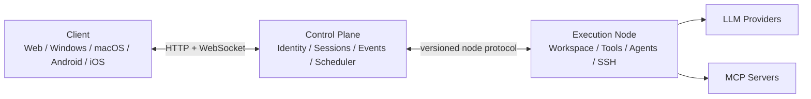

# Prometheus 总体架构

## 产品边界

Prometheus 是一个由三个可独立部署单元组成的系统：

### Client

- React 19 + TypeScript + Vite
- Tauri 2 复用同一前端，目标 Windows、macOS、Android、iOS
- 浏览器直接使用同一 WebUI
- 只通过协议访问工作区和 agent 状态，不假设本地文件系统存在

### Control Plane

- Node.js 24 + Fastify
- SQLite 起步，未来通过 repository port 切换 PostgreSQL
- append-only session event log 是跨端接续真相源
- WebSocket 只负责低延迟分发，重连后仍通过事件序号补齐

### Execution Node

- Foundation 阶段由 Control Plane 内嵌本地工作区适配器
- 当前 2B2-2B4 的 `write_file`、一次性 `shell_command`、持久权限策略与审批执行仍运行在该内嵌适配器中，审批可跨客户端但 pending resolver 和运行中命令不跨进程重启
- 当前 2C 的 Provider stream 由同一进程内 `RunStreamHub` 转发；它保存 session 当前 active snapshot，但不把 token delta 写入 SQLite
- 当前 3A 的 `TeamRunService` 在 Control Plane 内用有界 worker pool 调度 1-8 个已配置 Agent；每个 child run 使用独立 task context，共享同一 Provider/tool/approval runtime
- 当前 3B 的 `TeamRuntimeToolFactory` 按 primary/child 身份动态注入委派或通信工具；`TeamMessageRepository` 保存 durable bus，不用临时文件传话
- 当前 3C 的 `GitWorktreeManager` 独占 Git 生命周期：创建 task 分支/worktree、审计路径、生成 binary patch、保守 apply 和带 guard 的 cleanup；`TeamRunService` 只编排 durable 状态
- 3C 默认 child 为 readonly；worktree child 的文件和 Shell 工具全部重新绑定到独立 workspace root，并受每 Agent 显式路径所有权约束
- 后续拆分为 Rust daemon，负责文件、PTY、Git、SSH、MCP、Sandbox 和 Agent Runtime
- Provider API key 默认只存在节点本地的系统安全存储

## 核心领域

- `Workspace`：一个可由某个 Execution Node 访问的代码工作区（空间）。Control Plane 负责联通多个客户端/节点的空间与会话，而不是把所有客户端强制绑到 server 本机目录
- `Session`：用户可跨端接续的工作单元
- `Event`：会话中不可变、全序的事实
- `Agent`：消费上下文、产生事件并请求工具的执行者
- `Run`：Agent 的一次有明确持久边界的执行；跨进程恢复仍是后续能力
- `TeamRun`：一个 session 内的并行团队目标、并发上限和 durable 终态
- `TeamTask`：TeamRun 中绑定某个 Agent 的隔离 child task；一个 task 失败不取消其他 task
- `TeamMessage`：有 team sequence、channel、sender/recipient 和 source run/tool call 的持久 Agent 通信事实
- `ToolCall`：带权限、幂等性和审计信息的副作用边界
- `Approval`：用户或策略对高风险 ToolCall 的裁决
- `Artifact`：补丁、日志、截图、构建物等大对象引用

## 事件恢复不变量

1. 服务端分配单调递增 `sequence`。
2. 客户端以 `afterSequence` 增量拉取，不依赖 WebSocket 恰好送达。
3. `eventId` 全局唯一，重试写入保持幂等。
4. tool call 必须先写 `tool.call.started`，再执行副作用。
5. 未完成的非幂等 tool call 恢复时只标记 interrupted，不自动重放。
6. 所有运行时 provider/tool/skill/MCP 通过稳定 ID 恢复，不把函数对象序列化进数据库。
7. Provider delta 是 transient presentation state；只有完整 `message.agent` 才是 durable fact。
8. 新连接先按 `afterSequence` 补 durable event，再接收当前 active stream snapshot；snapshot 不占用 session sequence。
9. 同一 session 内 active stream 按 `runId` 隔离，清理某个 child run 不影响其他并行草稿。
10. Control Plane 重启时 queued/running TeamTask 标记为 `interrupted`，不自动重放。
11. Agent message 先持久化到 message bus，再发布 `agent.message`；未知或非 team 成员收件人必须拒绝。
12. child runtime 不注入 `delegate_team`，递归委派从 capability 集合上被禁止。
13. worktree 团队必须为每个 Agent 分配互不重叠的 workspace-relative 路径；越界变化只能进入 rejected 状态，不能应用。
14. 自动 apply 只执行通过 direct `git apply --check --binary` 的 patch；不自动运行 `--3way`、复制文件、commit、merge 或 push。
15. applied、no_changes 或显式 discard 才允许强制清理 dirty worktree；conflicted/rejected 结果保留现场。
16. 重启后只重新审计 isolated worktree，不重放 Provider/tool call，也不自动 apply。

## 安全模型

- 默认拒绝跨工作区路径访问，所有路径在节点端 canonicalize 后验证根目录边界。
- Provider/SSH/MCP secrets 不进入 session event payload。
- Tool 定义声明 capability、risk level、idempotency 和可用平台。
- 桌面端使用 OS keychain；服务端托管节点使用外部 secret store 或注入式环境变量。
- 高风险操作进入 approval event，客户端可在任意终端批准或拒绝。

### 网络暴露面

Control Plane 的能力集合等价于一个远程 shell，因此暴露面按「默认关闭、显式解锁」建模：

- **启动前校验**：`Config::validate_security()` 在 `TcpListener::bind` 之前运行。绑定非回环地址而未配置 `PROMETHEUS_ACCESS_TOKEN` 时直接拒绝启动——只监听一瞬间也等同于暴露。
- **鉴权中间件**：`/api/*` 与 `/ws*` 需要 Bearer 令牌（常量时间比较，支持 `Authorization` 头、`x-prometheus-token` 头、`?token=` 查询参数三种来源，后者是 WebSocket 握手无法设置自定义头的唯一出路）。`/api/health` 保持公开，否则客户端无法区分「服务器离线」与「令牌错误」。静态资源同样公开，否则连接设置界面自己都加载不出来。
- **CORS**：来源白名单取代 `Any`，由 `PROMETHEUS_ALLOWED_ORIGINS` 配置，缺省仅含本机开发地址与 Tauri 自定义协议。

### 终端能力

`TerminalMode` 是终端能力的总闸，默认 `Disabled`：

| 模式 | 语义 |
|---|---|
| `disabled` | PTY 与 exec 端点一律返回 403。 |
| `approval` | 每次开终端 / 执行命令都进入审批流。 |
| `trusted` | 免审批，但仅允许回环绑定；`validate_for_bind` 会在非回环时拒绝启动。 |

**能力等价则策略等价**：交互式 PTY（`/ws/terminal`）、一次性执行（`POST /api/terminal/exec`）与 agent 的 `shell_command` 工具共用 `TerminalSessionService` 这一条准入路径——权限规则求值（deny → ask → allow）→ 跨终端审批（5 分钟超时视为拒绝）→ durable 事件（`tool.call.started` / `permission.rule.matched` / `approval.requested` / `approval.resolved` / `tool.call.completed`）。exec 复用 `shell_command` 规则命名空间，用户已有策略自动生效；PTY 使用独立的 `terminal_session` 名字，因为「开一个交互式 shell」和「跑一条命令」是两个不同的决策。拒绝发生在 spawn 之前，且拒绝本身也是持久化事件。

两条终端通道在子进程创建时剥离同一份敏感环境变量清单（`PROMETHEUS_MASTER_KEY`、`*_API_KEY` / `*_TOKEN` / `*_SECRET` / `*_PASSWORD` 等），避免一条 `env` 就解开整个 SecretVault。

## 交付阶段

1. Foundation：工作区树、durable session、WebSocket 多端同步、Tauri 壳层。
2. Agent Core：多 Provider、流式 agent loop、tool registry、审批。
3. Team Runtime：3A 已交付手动选择 Agent、隔离 child context、durable roster/status 和有界并行调度；3B 已交付模型自主委派和 durable Agent message bus；3C 已交付显式路径所有权、真实 Git worktree、durable patch 审计、保守 apply、冲突保留与安全清理。
4. Extensions：Skills、MCP、Hooks、插件包、市场导入。
5. Operations：SSH/SFTP、PTY、端口转发、部署配方、定时任务。
6. Production：身份与租户、E2EE 选项、PostgreSQL、对象存储、审计与配额。
